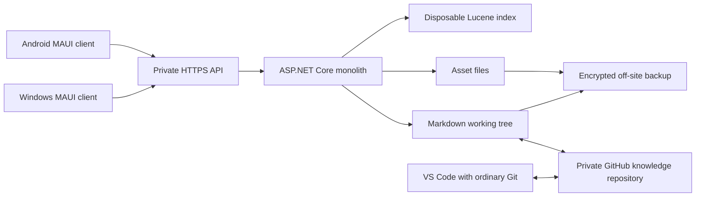

# slate.lib — Architecture

Status: implementation notes through Phase 3D, 2026-09-25. [PRODUCT](PRODUCT.md) owns scope; [CONTENT_AND_SYNC](CONTENT_AND_SYNC.md) owns data and consistency rules; [UX](UX.md) owns interactions; [ROADMAP](ROADMAP.md) owns delivery order; [OPERATIONS](OPERATIONS.md) owns deployment and recovery procedures. MVP completes through phases 3A–3D.

## System context

One owner uses two native clients and one home-server application. Application source and private knowledge are separate repositories. The mental model is a Git-backed Markdown directory, a separate asset directory, and a .NET service with an embedded search index.

GitHub stores pushed Markdown/history. It does not store the asset collection, run the API, or distribute content inside application packages. The server exclusively owns its checkout. External editors use another clone, never the live server directory.

## Key Architecture Decisions

| Decision | Choice | Why |
| --- | --- | --- |
| Knowledge source | UTF-8 Markdown and real folders | Portable and readable without the app |
| Note identity | UUID in YAML front matter | Survives path changes without an identity database |
| Internal links | Title/alias lookup; explicit ID links from the picker | Human-readable input plus stable generated references |
| Assets | Immutable UUID-named files outside Git; relative virtual `.assets/` references | Ordinary Markdown image syntax without large Git blobs |
| Backend | One ASP.NET Core modular monolith | One process to deploy and debug |
| Clients | .NET MAUI native shells/editors with platform-specific interactions | Shared .NET behavior without forcing identical UI |
| Rendering | Markdig plus a restricted local document WebView | Good Markdown layout; later diagrams/math fit the same surface |
| Search | Embedded Lucene.NET lexical search | Ranking/filters without a separate search service |
| Server persistence | Files; a small recovery record only for multi-file operations | No server database or generic transaction framework |
| Client persistence | Atomic draft/cache files plus small preferences JSON | No database needed for bounded recent content |
| Concurrency | One server writer; note ETags | Prevent silent overwrites with little coordination |
| Git synchronization | Batched commits, fetch before push, fast-forward imports | Boring normal path; divergence resolved with ordinary Git |
| Client refresh | Conditional reads and a disposable library version | No retained change feed, tombstone log, or client replica protocol |
| Authentication | Private tailnet + HTTPS + one revocable token per device | No accounts, roles, identity provider, or client Git credentials |
| Deployment | One container/workload on existing k3s with persistent storage | Uses the existing host without introducing microservices |
| Delivery | Signed Windows MSIX and Android APK | User-directed platform installation |

Path-only identity is rejected because moves are common; an external identity database is rejected because exporting/rebuilding must retain identity. Object storage, Git LFS, external search services, and an application database are unnecessary initially. SQLite may become useful for a real offline queue in phase 5; it is not a prerequisite for either client today.

## Stack and native-client feasibility

Start with supported .NET 10 / ASP.NET Core 10 and MAUI 10 servicing releases; pin SDK/workload/package versions when implementation starts. Recheck support then. MAUI has a shorter independent support lifecycle; its current policy lists MAUI 10 support through May 11, 2027. [Microsoft support policy](https://dotnet.microsoft.com/en-us/platform/support/policy/maui).

Product test baseline is Windows 11 x64 and Android 10/API 29 or newer. This is a product choice, not the framework's minimum. Choose Android target SDK from the supported workload. MAUI supports both platforms and exposes native platform controls. [Supported platforms](https://learn.microsoft.com/en-us/dotnet/maui/supported-platforms?view=net-maui-10.0).

Retain MAUI: no verified blocker justifies a framework switch, but a polished explorer is application work, not a supplied MAUI feature. Official capabilities establish feasibility; phase 1/2 device tests must establish usability.

| Requirement | Initial implementation and qualification |
| --- | --- |
| Windows explorer | Lazy flattened tree/list using virtualized collection controls, breadcrumbs and a native window layout. No dependency on a commercial tree suite; use a narrow WinUI handler only if needed. |
| Android navigation | Separate mobile pages, drill-down folders, touch actions and lifecycle-aware drafts. Share rules/services, not the desktop pane hierarchy. |
| Markdown editor | Native multiline Editor initially. Verify selection, undo, IME, caret restoration and 64-KiB editing on real devices. A 2-MiB server acceptance limit is not a promise of comfortable phone editing; allow large notes to open read-only with an explanation if necessary. Rich syntax editing is later. |
| Document renderer | Markdig-generated local HTML in WebView. Windows uses WebView2; Android uses the system WebView. Test installed packages and use an app-data WebView profile on Windows. |
| Keyboard/context menus | MAUI menu accelerators/context menus on Windows; native handlers for missing focus-scoped behavior. Android gets overflow/long-press actions. |
| Drag/drop and clipboard | Windows image-clipboard integration in the MVP; phase 4 adds drag/drop gestures/native data packages. Always retain menu equivalents. |
| Android receiving Share | Platform Activity/intent handling for `ACTION_SEND`, MIME types, and temporary content-URI permissions; the outbound share helper is not an incoming share implementation. |
| Storage and updates | Platform app-data/cache directories and secure storage; HTTP version checks later, with platform-specific installer handoff. No client database or silent updater needed. |

Capability references: [MAUI controls](https://learn.microsoft.com/en-us/dotnet/maui/user-interface/controls/?view=net-maui-10.0), [WebView](https://learn.microsoft.com/en-us/dotnet/maui/user-interface/controls/webview?view=net-maui-10.0), [keyboard accelerators](https://learn.microsoft.com/en-us/dotnet/maui/user-interface/keyboard-accelerators?view=net-maui-10.0), [context menus](https://learn.microsoft.com/en-us/dotnet/maui/user-interface/context-menu?view=net-maui-10.0), [drag/drop](https://learn.microsoft.com/en-us/dotnet/maui/fundamentals/gestures/drag-and-drop?view=net-maui-10.0), [Android receiving shared data](https://developer.android.com/training/sharing/receive), [app storage directories](https://learn.microsoft.com/en-us/dotnet/maui/platform-integration/storage/file-system-helpers?view=net-maui-10.0).

Use Markdig for the shared Markdown AST/rendering configuration; enable only supported extensions. Use a bounded safe YAML parser for front matter, without custom object deserialization. Phase 3C bundles pinned Mermaid, KaTeX and highlight.js resources for the shared offline reader. [Markdig documentation](https://github.com/xoofx/markdig).

Lucene.NET `4.8.0-beta00018` is the reviewed initial candidate. It remains beta-labeled; qualify it on the chosen .NET/Linux runtime in phase 2. Its embedded design fits the requirement, and its index is disposable. Change to SQLite FTS only if qualification finds a concrete blocker, with a corresponding spec change; do not implement both engines. [Apache releases](https://lucenenet.apache.org/download/download.html).

## Components and shared code

Use folders/modules in one server project: API/authentication, Library, Assets, Search, and Git sync. These are boundaries for understandable code, not required assemblies, interfaces or services. Direct calls are sufficient. Avoid command/event buses, repositories over the filesystem, provider frameworks, multiple DTO mapping layers and speculative extension interfaces.

Two small in-process hosted workers are justified: indexing keeps parsing off the save path; Git sync keeps network work off it. Wake indexing with an in-memory set of dirty note IDs; wake Git with a pending flag/timer. Reconcile from files at startup if those signals were lost. No durable queue or event log. Use one writer lock for live-tree changes and an OS lock on the data root to reject a second process. A separate Git gate serializes Git commands; fixed lock order is Git gate, then library writer when both are needed. Ordinary saves take only the writer lock and never call Git while holding it. Network operations do not hold the writer lock.

Share models/contracts, API client, metadata/link rules, Markdown configuration, ETag/conflict handling and draft storage helpers between clients. Start with only a content/contracts library and a client-core library where code is actually shared. Keep Windows windows/panes, accelerators, clipboard, drag/drop, menus and installers platform-specific. Keep Android Share activities, content-URI access, touch layout, lifecycle, keyboard insets and installation platform-specific. Share view models only when behavior matches.

**Phase 3B implementation:** `Slate.Lib.Core` now owns the capture contract/client call, atomic per-draft JSON records, one-second draft debounce, pending-capture retry, bounded cached-note records and bounded recent IDs. `Slate.Lib.App` retains the Windows pane shell and adds a separate mobile tab/drill-down page set. Android-specific code is limited to the exported `ACTION_SEND` activity/application and manifest. Incoming plain text/URLs are copied to atomic app-data records before UI dispatch. Both clients use platform secure storage for the token and MAUI app-data/cache roots. No SQLite database, background queue, Android-only API, or full Library replica was introduced.

## Storage responsibilities

Mount host `/srv/slate/` as container `/data/` on a local persistent filesystem. Keep the working tree, operation staging and state on the same filesystem for atomic replacements.

| Directory | Contents | Backup |
| --- | --- | --- |
| `library/` | Canonical Markdown, folder markers, small library configuration, `.git` including local-only commits | Required, including uncommitted files |
| `assets/objects/` | Immutable `<uuid>.<ext>` bytes | Required |
| `assets/metadata/` | Type, filename, hash, size and upload time per asset | Required |
| `state/` | Token hashes, sync diagnostic/last observed remote head, one pending operation, operator recovery bundles when present | Required; some of this is not rebuildable |
| `derived/` | Lucene index and optional extracted-link cache | Rebuildable, exclude from backup |
| `staging/` | Unpublished upload temporary files | Disposable; prepared operations must move needed payloads into `state/` |
| `releases/` | Optional signed artifacts/manifest starting phase 4 | Reproducible; signing keys backed up separately |

The library ID lives in `.slate/library.json` in Git, not a second authoritative server record. A current in-memory ID/path map is rebuilt from Markdown and updated synchronously on writes. It is separate from the asynchronous search index. No PostgreSQL, server SQLite, Redis, broker or external search process.

Both clients fetch notes/listings on demand. Persist recently opened source/revision/path records, small preferences and local drafts as atomic files; asset bytes have a bounded cache. No full clone, local full-library metadata inventory, or client search index in the MVP. See CONTENT_AND_SYNC for limits and recovery behavior.

## Search and incremental work

**Phase 3A implementation:** Lucene.NET `4.8.0-beta00018` is qualified by the automated Windows/.NET 10 suite. The configured `Data:DerivedPath/search` directory is outside the Markdown repository. Startup compares stored indexed revisions with current note revisions and updates only differences; a missing/corrupt index is recreated, and `--rebuild-index` performs an explicit full rebuild. Accepted API mutations publish their affected documents synchronously so a successful response is immediately searchable. Folder operations and validated Git imports reconcile ID/revision/path differences without deleting and rebuilding the whole index. Search failure is reported separately and never makes durable source unreadable.

One Lucene index, one writer, reusable readers. Index title, aliases, headings, body/code text, path, tags, type/status, resolved link IDs, diagram/code flags and useful dates. Use exact fields for filtering and analyzed fields for terms; start with a Unicode-aware standard analyzer without stemming. BM25 with title/alias/heading boosts is sufficient; tune using fixtures instead of specifying arbitrary scoring constants upfront.

API saves add affected IDs to the dirty set. Git imports compare old/new tree blobs. A stable ID at a new path updates the same search document; deletes remove it. Compare persisted indexed revisions with source at startup and reindex only mismatches. No full reindex for a one-note change. Keep extracted link targets in memory and initially re-resolve them in a debounced pass when target names/paths change; optimize that pass with reverse dependency maps only if measured cost warrants it.

If the index is missing/corrupt, direct reads and writes remain available while search reports rebuilding. Rebuild in place initially, with search temporarily unavailable; keeping two live indexes and catch-up watermarks is not an MVP requirement. A disposable search version changes when published results change, independently of the library version, so clients refresh after delayed indexing. Expose pending/failed indexing and each result's indexed revision; always fetch the current source when opening a hit.

Before MVP release, benchmark 20,000 synthetic notes totaling roughly 200 MiB on documented 4-core/8-GiB/SSD hardware: warm server search p95 ≤ 200 ms for 20 hits; folder first-page p95 ≤ 200 ms; 64-KiB save p95 ≤ 300 ms; normally searchable within 2 seconds of save. Use at least 100 representative operations and report cold-start/rebuild times separately. These are qualification targets, not claims of measured performance. Test responsiveness on actual Windows/Android devices; do not require exhaustive pixel-level UI tests.

## Network, authentication and rendering safety

Tailscale provides private reachability; HTTPS and per-device bearer tokens protect API requests. Use Tailscale Serve on the host to the internal k3s service; no public ingress, NodePort, Funnel, or forwarded WAN/LAN API port. Verify the configured firewall/network boundary rather than assuming ClusterIP alone makes access private. [Tailscale Serve](https://tailscale.com/docs/features/tailscale-serve).

A local admin command generates a random 256-bit token for each device, displays it once for manual entry, and stores its SHA-256 hash/label/revocation state. Windows and Android send it in the authorization header and keep it in platform secure storage. No password system, roles, registration endpoint or JWT infrastructure. Revoke a lost device locally; previously cached data cannot be remotely erased. Pairing QR polish is later.

Keep repository-scoped Git credentials on the server only, verify the GitHub SSH host, disable prompts/hooks/filters, and pass Git argument arrays without a shell. Only configured remote URLs and validated refs/paths are accepted. Keep deployment/signing secrets separate. Logs omit bodies/tokens. Source CI uses synthetic fixtures and must never clone the private knowledge repository or upload personal library/backups as artifacts.

Use native shell/editor controls. The document WebView loads generated local files: raw HTML is disabled, output is allowlisted/sanitized, safe link/image schemes only, no arbitrary network requests, no unrestricted native bridge, and no credentials in the page. The host fetches authenticated images and converts them to local data resources. External links open the system browser after a tap; remote images stay blocked. The server never fetches arbitrary note URLs. Mermaid, KaTeX and highlight.js are pinned embedded resources, executed under a local-only CSP; Mermaid strict mode and KaTeX `trust:false` keep note text from becoming executable script.

Validate normalized path containment, reject symlinks/submodules/executable Git modes, bound note/YAML/upload sizes, inspect upload types, and render only supported image types inline. SVG/HTML/unknown attachments are downloads. OS app-data permissions and device disk encryption protect local files; exclude token/draft/cache files from automatic platform cloud backup where supported. Sign-out offers draft export before clearing local data. This is enough for the initial personal threat boundary; no enterprise security subsystem.

## Phase 3A Git implementation

The server uses the installed Git CLI through `ProcessStartInfo.ArgumentList`; it never invokes a shell or accepts command/ref/path arguments from API callers. One `GitSyncService` gate serializes staging, commits, fetch/push, activation and history. `--initialize-git` is the only operation that creates a repository. Managed Markdown, `.slate/library.json` and folder markers are staged; hidden/unsupported files are not enrolled. Commit batching defaults to 30 quiet seconds with a two-minute cap and flushes before Sync, deletion and clean shutdown.

Remote synchronization is optional. Sync fetches before push, validates ordinary file modes, safe/case-unique paths, library identity, note size/schema/UUID uniqueness and working-tree attributes, then imports remote-ahead history only with `--ff-only`. A safety ref plus a flushed pending-import record allow startup to finish or abandon a known interrupted activation. Rewritten or diverged histories stop with both heads preserved. Git failures leave filesystem saves and Lucene search operational. Read-only note history comes directly from commits and resolves historical content by stable note UUID, including across practical Git renames.

## Deployment and application updates

Use one non-root container, one `replicas: 1` Deployment with `Recreate`, one internal Service, persistent storage, mounted secrets and ordinary resource/health settings. Pin to the data-bearing node. The filesystem lock is the singleton guard; volume access mode and rollout strategy alone do not guarantee it. [Kubernetes deployment strategy](https://kubernetes.io/docs/concepts/workloads/controllers/deployment/).

Readiness waits for filesystem recovery, authentication state and writable canonical storage; search may be rebuilding. Liveness does not depend on GitHub. Status shows Git/index/disk/backup failures without exposing physical paths. A Kubernetes CronJob scales the singleton workload to zero, waits for shutdown/data-lock release, runs encrypted restic backup/check/retention, then restores the previous replica count even after failure. Simply killing the pod is insufficient because k3s restarts it. Clients retain drafts during this maintenance window, whose duration depends on backup size/speed. Filesystem-snapshot coordination can replace the interruption later if needed.

Source CI builds/tests with synthetic data. Main pushes publish immutable backend/backup image tags and deploy the exact SHA to the home server over Tailscale and narrowly scoped SSH. Phase 3D tagged releases produce signed Windows MSIX and Android APK packages. Keep package identities and signing keys stable and backed up. Platform references: [Windows MSIX](https://learn.microsoft.com/en-us/dotnet/maui/windows/deployment/publish-cli?view=net-maui-10.0), [Android APK](https://learn.microsoft.com/en-us/dotnet/maui/android/deployment/publish-cli?view=net-maui-10.0).

Phase 3D includes a small authenticated release manifest and package endpoint on the existing service. Clients check at most daily/on demand, show version and notes, verify downloaded checksums, and hand off to the OS installer with user consent; platform signatures establish publisher trust. No GitHub tokens enter clients and there are no silent installs. An incompatible API version gives an update message while drafts remain exportable.

A knowledge push invokes no build, container rollout or client release. Git polling imports content and updates the search index; client refreshes display it. Application changes and content changes are separate paths.

## Backup, failures and restore

GitHub contains pushed Markdown/history only. Nightly encrypted off-site backup must include `library/` including `.git` and uncommitted files, `assets/`, and `state/`. Use restic or the owner's existing equivalent tool; keep 7 daily, 4 weekly and 6 monthly snapshots. Keep signing keys and recovery credentials separately recoverable. Assets/unpushed work have a desired recovery point of ≤ 24 hours when backups succeed; display the last success/failure through a simple host-written status file.

Before irreplaceable content enters the system, test restoring a backup onto an empty data root. Finish any pending operation, validate note IDs/paths, verify sample asset hashes, rebuild the index, and inspect local/remote Git heads before enabling sync. Clients see a new disposable library version and revalidate open content without discarding drafts. Demonstrate recovery of a current note, its history, a deleted note, and an image. Git cannot reconstruct missing asset bytes.

Git failures are distinguished from disk failures. A failed push leaves local content/history intact. A broken Git repository disables sync and operations needing a history checkpoint, while ordinary atomic saves can continue if filesystem integrity is intact; a persistent warning explains that new history is unavailable. Preserve the entire data root before operator repair. Disk/permission/recovery failure blocks affected writes and never acknowledges Saved. Detailed recovery steps are in CONTENT_AND_SYNC.

## Intentionally Deferred Complexity

- Full offline-first replication, local search indexes, queued replay, client SQLite, tombstones and durable change feeds.
- Automatic divergent Git merging, semantic conflict detection, in-app three-way merge tools and history/diff UI.
- Cross-library automatic link-repair transactions, bulk explorer operations and full-library client downloads.
- Zero-downtime reindexing/backups, deployment agents, public webhooks, extra Kubernetes services/operators and horizontal scaling.
- Object-storage providers, asset deduplication/garbage collection across Git history, OCR/PDF extraction and plugin frameworks.
- Semantic search, vectors/embeddings, AI, graph visualization, learning analytics and recommendations.
- Multi-user support, collaboration, roles, organizations, billing and enterprise infrastructure.

The later product vision remains in PRODUCT and ROADMAP. Deferral is an instruction not to prebuild abstractions for it.
