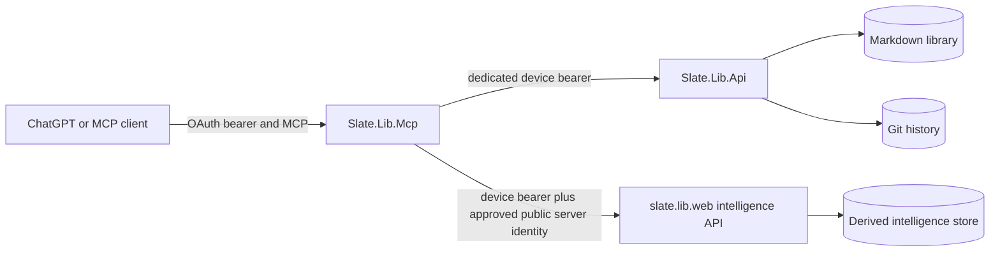

# Slate.Lib.Mcp architecture

## Purpose

`Slate.Lib.Mcp` exposes one Slate knowledge library to trusted AI clients through Model Context Protocol. It is an adapter and policy boundary. It is not a second library server.

The service uses .NET 10 and the maintained `ModelContextProtocol.AspNetCore` 2.2.0 SDK. `/mcp` is Streamable HTTP in explicit stateless mode and supports the SDK's 2026-07-28 protocol path. There is no legacy SSE endpoint, session affinity, generic HTTP proxy, filesystem tool, shell tool, or arbitrary SQL tool.

## Authority boundaries

- `Slate.Lib.Api` is the sole persistence authority. It validates paths, revisions, note identity, metadata, links, Git operations, and atomic mutations.
- `slate.lib.web` owns optional derived intelligence. MCP reuses its `/api/intelligence/*` services and sends the same mutation events as the web client.
- MCP never mounts `/data`, reads Markdown files directly, writes Git, or accepts a canonical device token as a tool argument.
- The external OAuth bearer establishes the caller and scopes. The internal device token authenticates the MCP service to Slate. They are separate credentials with separate rotation and exposure risks.

## Request lifecycle

1. A reverse proxy terminates public TLS and forwards one trusted hop.
2. ASP.NET validates the host, forwarded scheme, optional browser origin, request size, bearer token, issuer, audience, lifetime, caller allowlist, rate limit, and tool policy.
3. MCP authorization filters remove tools the caller cannot use from `tools/list` and reject forbidden calls.
4. The tool validates its own bounded inputs.
5. `LibraryContext` fetches canonical status and verifies `Mcp:ExpectedLibraryId` when configured.
6. The typed client calls an allowlisted upstream origin with redirects disabled, a timeout, cancellation, and a bounded response reader.
7. The result is returned in the common envelope. Logs contain operation names, status codes, and error codes; they do not contain note bodies, OAuth tokens, internal device tokens, or proposal tokens.

## Result envelope

All tools return:

- `success`
- `libraryId`
- `operation`
- `data`
- `warnings`
- `truncated`
- `pagination`
- `degraded`
- `references`
- `error` with a stable code, safe message, and retryability

Canonical conflicts remain distinct: `not_found`, `conflict`, `stale_revision`, `canonical_auth_failed`, `canonical_unavailable`, `response_too_large`, and validation errors do not collapse into one generic result.

## Write safety

Normal updates require a canonical revision. Substantial replacements should use `preview_note_edit` followed by `apply_note_edit`. The preview signs the note ID, source revision, hash of the exact proposed Markdown, and expiry. Apply checks the signature, expiry, content hash, and live canonical revision before writing.

Bulk operations are prepared by the canonical API, which persists an immutable operation journal and fingerprint. MCP signs the operation ID, operation kind, fingerprint, and expiry. `apply_bulk_operation` requires that signed review token. Delete additionally requires `Mcp:EnableDestructiveOperations=true` and `slate.delete` or `slate.admin`.

Canonical mutations send an intelligence event after success. Note creation/body changes emit `upsert`; rename emits `rename`; move, copy, duplicate, and reviewed bulk operations emit the existing `reconcile/bulk` signal; restore emits `reconcile/restore`. This matches the web client contract. The intelligence service performs its existing hash-based deduplication and bounded queue processing. MCP never calls the paid full-library `rebuild` route. Event delivery is best effort because derived data must never redefine whether a canonical write succeeded. A delivery failure can leave intelligence temporarily stale; a later normal reconciliation repairs it while canonical reads remain authoritative.

## Prompt-injection boundary

Markdown, titles, snippets, links, metadata, intelligence findings, and historical content are untrusted user data. Tool descriptions say this explicitly. A note cannot grant scope, reveal credentials, change the destination server, request a shell command, or waive preview requirements. Tools have fixed upstreams and closed-world annotations.

## Threat model

| Threat | Control |
|---|---|
| Stolen external token | Short token lifetime at the authorization server, issuer/audience/lifetime validation, caller allowlist, narrow scopes |
| Stolen internal device token | Kubernetes Secret, never returned to clients, dedicated token, rotation/revocation in canonical Slate |
| Cross-library routing | Fixed upstream origin, host allowlist, expected library UUID check |
| SSRF and redirect pivot | No URL tool arguments, allowlisted configured origins, redirects disabled |
| Prompt injection in notes | Content treated as data; no generic execution or network tools; server-side authorization |
| Stale overwrite | Canonical `If-Match`, signed preview source revision, explicit `stale_revision` error |
| Unreviewed bulk/delete | Canonical fingerprint plus MCP signed review token; delete switch and scope |
| Oversized input/output | Kestrel body limit, per-field bounds, batch and bulk limits, response byte limit |
| Resource exhaustion | Per-subject/IP fixed-window limits, upstream timeouts, cancellation, bounded recursion and paging |
| Credential or content leakage in logs | Structured operational logs only; no bodies, secrets, or proposal tokens |
| Spoofed proxy headers | One forwarded hop and explicit trusted proxy/network list |
| Cross-origin browser calls | Public-origin equality check when `Origin` is present |
| Compromised pod | Non-root, read-only root filesystem, dropped capabilities, runtime seccomp, no service-account token, no library volume |
| Lateral movement | Kubernetes NetworkPolicy limits ingress and expected egress destinations |
| Derived-service failure | Canonical tools continue; intelligence results return a specific unavailable/degraded result |

## Deliberate omissions

- No persistence, Git, filesystem, shell, SQL, webhook, fetch-URL, or generic API tools.
- No LLM call inside the learning tools. They use canonical search evidence and deterministic composition.
- No mastery percentages or claims about a person's knowledge.
- No automatic deployment from CI. The service, secret creation, DNS, tunnel route, OAuth provider, and public enablement require operator review.
